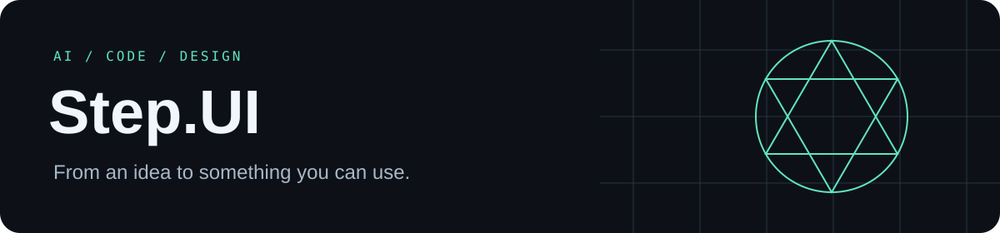
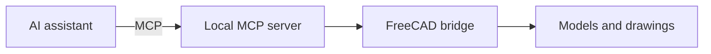

<div align="center">



[Русский](README.md) · **English** · [Español](README.es.md)

**AI tools · Automation · Interface design**

I build AI tools, automation and interfaces. I like connecting language models to practical work: data, applications and CAD.

[FreeCAD MCP](#freecad-mcp) · [S2K Studio](#s2k-studio) · [Telegram](https://t.me/stp_des)

</div>

---

## About me

My interests meet at **AI, development and design**. I work with Python, JavaScript and TypeScript, exploring local models and MCP integrations. I am part of **S2K Studio**, a digital product studio based in Nizhny Novgorod.

`Python` · `TypeScript` · `JavaScript` · `MCP` · `Local LLMs` · `UI/UX`

## Choose your path

| Looking for… | Start here |
| --- | --- |
| AI-assisted CAD workflows | [FreeCAD MCP](#freecad-mcp) |
| A digital product conversation | [S2K Studio](#s2k-studio) |
| A look under the hood | Expand the section below |

## FreeCAD MCP

A local bridge between AI assistants and FreeCAD: models, sketches, drawings and file exports through the Model Context Protocol.


[Repository](https://github.com/Mizzzord/FreeCAD-MCP-by-staf_37) · [Releases](https://github.com/Mizzzord/FreeCAD-MCP-by-staf_37/releases) · [Documentation](https://github.com/Mizzzord/FreeCAD-MCP-by-staf_37#readme)

<details>
<summary>🛠 Under the hood: from AI to CAD</summary>

The AI client calls the MCP server, the local bridge passes operations to FreeCAD, and the result comes back to the assistant’s workspace.



</details>

<details>
<summary>💬 Try this prompt</summary>

> Create a 60 × 40 × 12 mm plate in FreeCAD with a central Ø12 mm hole. Make a drawing with three views and save the model as FCStd and STEP. Preserve existing documents.

</details>

## S2K Studio

**S2K Studio** turns workflows into digital products: websites, web applications, Telegram bots and AI integrations. Our work connects research, design, development and improvement after launch.

| Area | What we work on |
| --- | --- |
| AI & automation | Assistants, data processing and workflow integrations |
| Web & Telegram | Websites, web applications, bots and Mini Apps |
| Design | Interfaces, prototypes and visual systems |

**[s2k.studio](https://s2k.studio/) · [GitHub / STK-studio](https://github.com/STK-studio)**

<details>
<summary>🔬 Inside the S2K lab</summary>

The studio website presents tool directions including **PulseFrame** for video from scripts and assets, **VoicePilot** for voice and chat requests, **SpaceForge** for CAD visualization, and **LogSentry** for logs and incidents. Visit the studio website for details and the status of each direction.

</details>

<details>
<summary>🎲 A small CAD Easter egg: spin the model</summary>

Rotate, zoom and switch display modes. This small geometric model is embedded in Markdown with GitHub’s viewer.

```stl
solid mcp_gem
  facet normal 0.609208 0.609208 0.507673
    outer loop
      vertex 0 0 24
      vertex 20 0 0
      vertex 0 20 0
    endloop
  endfacet
  facet normal -0.609208 0.609208 0.507673
    outer loop
      vertex 0 0 24
      vertex 0 20 0
      vertex -20 0 0
    endloop
  endfacet
  facet normal -0.609208 -0.609208 0.507673
    outer loop
      vertex 0 0 24
      vertex -20 0 0
      vertex 0 -20 0
    endloop
  endfacet
  facet normal 0.609208 -0.609208 0.507673
    outer loop
      vertex 0 0 24
      vertex 0 -20 0
      vertex 20 0 0
    endloop
  endfacet
  facet normal 0.609208 0.609208 -0.507673
    outer loop
      vertex 0 0 -24
      vertex 0 20 0
      vertex 20 0 0
    endloop
  endfacet
  facet normal -0.609208 0.609208 -0.507673
    outer loop
      vertex 0 0 -24
      vertex -20 0 0
      vertex 0 20 0
    endloop
  endfacet
  facet normal -0.609208 -0.609208 -0.507673
    outer loop
      vertex 0 0 -24
      vertex 0 -20 0
      vertex -20 0 0
    endloop
  endfacet
  facet normal 0.609208 -0.609208 -0.507673
    outer loop
      vertex 0 0 -24
      vertex 20 0 0
      vertex 0 -20 0
    endloop
  endfacet
endsolid mcp_gem
```

[STL ↗](assets/mcp-gem.stl)

</details>

## Get in touch

[Telegram · @stp_des](https://t.me/stp_des) · [S2K Studio](https://s2k.studio/) · [GitHub](https://github.com/Mizzzord)

---

<div align="center">

<sub>AI with a practical use. Code with a clear purpose. Design with people in mind.</sub>

</div>
