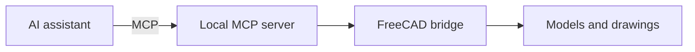

<div align="center">


[Русский](README.md) · [English](README.en.md) · **Español**

**AI tools · Automation · Interface design**

Creo herramientas de IA, automatizaciones e interfaces. Me interesa conectar los modelos de lenguaje con tareas concretas: datos, aplicaciones y CAD.

[Renamorph](#renamorph) · [FreeCAD MCP](#freecad-mcp) · [S2K Studio](#s2k-studio) · [Telegram](https://t.me/stp_des)

</div>

---

## Sobre mí

Mis intereses se encuentran en la **IA, el desarrollo y el diseño**. Trabajo con Python, JavaScript y TypeScript, y exploro modelos locales e integraciones MCP. Formo parte de **S2K Studio**, un estudio de productos digitales de Nizhni Nóvgorod.

`Swift` · `Python` · `TypeScript` · `JavaScript` · `MCP` · `Local LLMs` · `UI/UX`

## Elige tu camino

| ¿Te interesa…? | Empieza aquí |
| --- | --- |
| Convertir archivos en Mac cambiando la extensión | [Renamorph](#renamorph) |
| Trabajar con CAD mediante IA | [FreeCAD MCP](#freecad-mcp) |
| Hablar sobre un producto digital | [S2K Studio](#s2k-studio) |
| Ver cómo funciona | Abre la sección siguiente |

## Renamorph

Una utilidad de la barra de menús de macOS: cambiar la extensión solicita una conversión local con detección del contenido, copia del original y función Deshacer.


[Descargar para macOS](https://github.com/Mizzzord/Renamorph/releases) · [Repositorio](https://github.com/Mizzzord/Renamorph) · [README en español](https://github.com/Mizzzord/Renamorph/blob/main/README.es.md)

**29 formatos · 264 rutas.** Imágenes, audio, vídeo y subtítulos. La versión preliminar está comprobada en macOS 27 / Apple Silicon / APFS local; firma ad-hoc, sin notarización.

[](https://github.com/Mizzzord/Renamorph/stargazers) [](https://github.com/Mizzzord/Renamorph/releases)

## FreeCAD MCP

Un puente local entre los asistentes de IA y FreeCAD: modelos, bocetos, planos y exportación de archivos mediante Model Context Protocol.


[Repositorio](https://github.com/Mizzzord/FreeCAD-MCP-by-staf_37) · [Versiones](https://github.com/Mizzzord/FreeCAD-MCP-by-staf_37/releases) · [Documentación en español](https://github.com/Mizzzord/FreeCAD-MCP-by-staf_37/blob/main/docs/README.es.md)

<details>
<summary>🛠 Por dentro: de la IA al CAD</summary>

El cliente de IA llama al servidor MCP; el puente local transmite las operaciones a FreeCAD y devuelve el resultado al espacio de trabajo del asistente.



</details>

<details>
<summary>💬 Prueba esta petición</summary>

> Crea en FreeCAD una placa de 60 × 40 × 12 mm con un agujero central de Ø12 mm. Prepara un plano con tres vistas y guarda el modelo en FCStd y STEP. Conserva los documentos existentes.

</details>

## S2K Studio

**S2K Studio** transforma procesos de trabajo en productos digitales: sitios web, aplicaciones web, bots de Telegram e integraciones de IA. Combinamos investigación, diseño, desarrollo y mejora después del lanzamiento.

| Área | En qué trabajamos |
| --- | --- |
| IA y automatización | Asistentes, procesamiento de datos e integración de procesos |
| Web y Telegram | Sitios web, aplicaciones, bots y Mini Apps |
| Diseño | Interfaces, prototipos y sistemas visuales |

**[s2k.studio](https://s2k.studio/) · [GitHub / STK-studio](https://github.com/STK-studio)**

<details>
<summary>🔬 Dentro del laboratorio de S2K</summary>

La web del estudio presenta líneas de herramientas como **PulseFrame**, para crear vídeos a partir de guiones y materiales; **VoicePilot**, para solicitudes por voz y chat; **SpaceForge**, para visualización CAD; y **LogSentry**, para registros e incidentes. Consulta la web para conocer los detalles y el estado de cada línea.

</details>

<details>
<summary>🎲 Una sorpresa CAD: gira el modelo</summary>

Gira, acerca y cambia el modo de visualización. Este pequeño modelo geométrico está integrado en Markdown mediante el visor de GitHub.

```stl
solid mcp_gem
  facet normal 0.609208 0.609208 0.507673
    outer loop
      vertex 0 0 24
      vertex 20 0 0
      vertex 0 20 0
    endloop
  endfacet
  facet normal -0.609208 0.609208 0.507673
    outer loop
      vertex 0 0 24
      vertex 0 20 0
      vertex -20 0 0
    endloop
  endfacet
  facet normal -0.609208 -0.609208 0.507673
    outer loop
      vertex 0 0 24
      vertex -20 0 0
      vertex 0 -20 0
    endloop
  endfacet
  facet normal 0.609208 -0.609208 0.507673
    outer loop
      vertex 0 0 24
      vertex 0 -20 0
      vertex 20 0 0
    endloop
  endfacet
  facet normal 0.609208 0.609208 -0.507673
    outer loop
      vertex 0 0 -24
      vertex 0 20 0
      vertex 20 0 0
    endloop
  endfacet
  facet normal -0.609208 0.609208 -0.507673
    outer loop
      vertex 0 0 -24
      vertex -20 0 0
      vertex 0 20 0
    endloop
  endfacet
  facet normal -0.609208 -0.609208 -0.507673
    outer loop
      vertex 0 0 -24
      vertex 0 -20 0
      vertex -20 0 0
    endloop
  endfacet
  facet normal 0.609208 -0.609208 -0.507673
    outer loop
      vertex 0 0 -24
      vertex 20 0 0
      vertex 0 -20 0
    endloop
  endfacet
endsolid mcp_gem
```

[STL ↗](assets/mcp-gem.stl)

</details>

## Contacto

[Telegram · @stp_des](https://t.me/stp_des) · [S2K Studio](https://s2k.studio/) · [GitHub](https://github.com/Mizzzord)

---

<div align="center">

<sub>IA con utilidad práctica. Código con un propósito claro. Diseño pensado para las personas.</sub>

</div>
