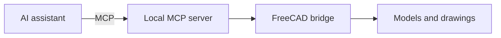

<div align="center">


**Русский** · [English](README.en.md) · [Español](README.es.md)

**AI tools · Automation · Interface design**

Создаю AI-инструменты, автоматизацию и интерфейсы. Мне интересно соединять языковые модели с реальной работой: данными, приложениями и CAD.

[FreeCAD MCP](#freecad-mcp) · [S2K Studio](#s2k-studio) · [Telegram](https://t.me/stp_des)

</div>

---

## Обо мне

Здесь пересекаются три интереса: **AI, разработка и дизайн**. Работаю с Python, JavaScript и TypeScript; исследую локальные модели и MCP-интеграции. Участвую в работе **S2K Studio** — студии цифровых продуктов из Нижнего Новгорода.

`Python` · `TypeScript` · `JavaScript` · `MCP` · `Local LLMs` · `UI/UX`

## Выбери, что тебе интересно

| Хочешь… | Начни здесь |
| --- | --- |
| Управлять CAD через AI | [FreeCAD MCP](#freecad-mcp) |
| Обсудить цифровой продукт | [S2K Studio](#s2k-studio) |
| Заглянуть под капот | Раскрой раздел ниже |

## FreeCAD MCP

Локальный мост между AI-ассистентом и FreeCAD: модели, эскизы, чертежи и экспорт файлов через Model Context Protocol.


[Репозиторий](https://github.com/Mizzzord/FreeCAD-MCP-by-staf_37) · [Релизы](https://github.com/Mizzzord/FreeCAD-MCP-by-staf_37/releases) · [Документация на русском](https://github.com/Mizzzord/FreeCAD-MCP-by-staf_37/blob/main/docs/README.ru.md)

<details>
<summary>🛠 Под капотом: как AI добирается до CAD</summary>

AI-клиент обращается к MCP-серверу, локальный мост передаёт операции в FreeCAD, а результат возвращается в рабочее пространство ассистента.



</details>

<details>
<summary>💬 Попробуй такой запрос</summary>

> Создай в FreeCAD пластину 60 × 40 × 12 мм с центральным отверстием Ø12 мм. Подготовь чертёж с тремя видами и сохрани модель в FCStd и STEP. Сохрани существующие документы.

</details>

## S2K Studio

**S2K Studio** превращает рабочие процессы в цифровые продукты: сайты, веб-приложения, Telegram-боты и AI-интеграции. В работе соединяем исследование, дизайн, разработку и развитие после запуска.

| Направление | Что делаем |
| --- | --- |
| AI и автоматизация | Ассистенты, обработка данных, интеграции с рабочими процессами |
| Веб и Telegram | Сайты, веб-приложения, боты и Mini Apps |
| Дизайн | Интерфейсы, прототипы и визуальные системы |

**[s2k.studio](https://s2k.studio/) · [GitHub / STK-studio](https://github.com/STK-studio)**

<details>
<summary>🔬 Что есть в лаборатории S2K</summary>

На сайте студии представлены направления инструментов: **PulseFrame** — видео из сценария и материалов; **VoicePilot** — голосовые и чат-заявки; **SpaceForge** — визуализация CAD; **LogSentry** — работа с логами и инцидентами. Подробности и состояние каждого направления — на сайте студии.

</details>

<details>
<summary>🎲 Маленькая CAD-пасхалка: покрути модель</summary>

Вращай, приближай и переключай режим отображения. Это небольшая геометрическая модель, встроенная в Markdown через просмотрщик GitHub.

```stl
solid mcp_gem
  facet normal 0.609208 0.609208 0.507673
    outer loop
      vertex 0 0 24
      vertex 20 0 0
      vertex 0 20 0
    endloop
  endfacet
  facet normal -0.609208 0.609208 0.507673
    outer loop
      vertex 0 0 24
      vertex 0 20 0
      vertex -20 0 0
    endloop
  endfacet
  facet normal -0.609208 -0.609208 0.507673
    outer loop
      vertex 0 0 24
      vertex -20 0 0
      vertex 0 -20 0
    endloop
  endfacet
  facet normal 0.609208 -0.609208 0.507673
    outer loop
      vertex 0 0 24
      vertex 0 -20 0
      vertex 20 0 0
    endloop
  endfacet
  facet normal 0.609208 0.609208 -0.507673
    outer loop
      vertex 0 0 -24
      vertex 0 20 0
      vertex 20 0 0
    endloop
  endfacet
  facet normal -0.609208 0.609208 -0.507673
    outer loop
      vertex 0 0 -24
      vertex -20 0 0
      vertex 0 20 0
    endloop
  endfacet
  facet normal -0.609208 -0.609208 -0.507673
    outer loop
      vertex 0 0 -24
      vertex 0 -20 0
      vertex -20 0 0
    endloop
  endfacet
  facet normal 0.609208 -0.609208 -0.507673
    outer loop
      vertex 0 0 -24
      vertex 20 0 0
      vertex 0 -20 0
    endloop
  endfacet
endsolid mcp_gem
```

[STL ↗](assets/mcp-gem.stl)

</details>

## Связаться

[Telegram · @stp_des](https://t.me/stp_des) · [S2K Studio](https://s2k.studio/) · [GitHub](https://github.com/Mizzzord)

---

<div align="center">

<sub>AI с практическим применением. Код с понятной целью. Дизайн с вниманием к человеку.</sub>

</div>
